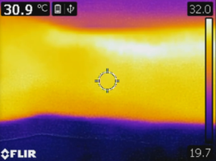
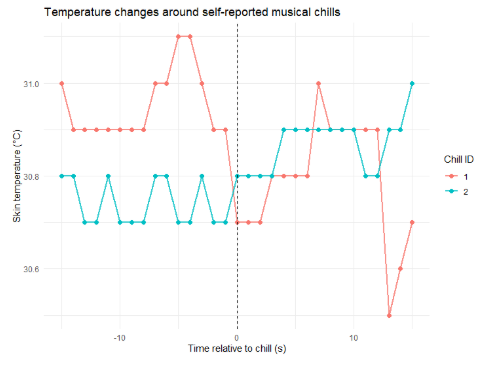
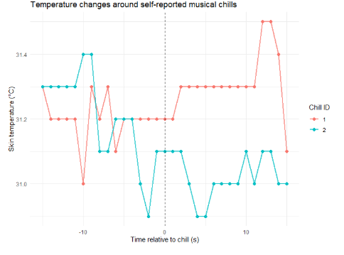
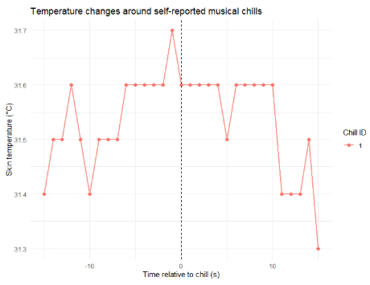

# Miniproject - Musical Chills and Temperature

### **Oliver Søndermølle Hansen**

**Student nr: 20214878**

**MED7 - Sound and Music Perception and Cognition**

## Acknowledgements

AI tools such as ChatGPT were used in this project for the layout/setup of this Github page as well as debugging for the data visualization.

# Introduction

Music has been seen as the language of emotions by many individuals[1]. Being able to convey a vast amount of emotions in those who listen, music has been a very complex and difficult area to study. This is evident as each person experiences music differently based on their habitus (their disposition they have developed since they were born). A musical piece might remind you of a certain memory which can elicit the emotion associated with said memory. Thus, there is no universal baseline on how people as a collection interpret music. 
Music does not only have the ability to elicit emotion, in some cases it can even produce autonomic responses such as chills. This also ties together with subjective relationships with music, as not all people experience chills for the same music.

## Musical Chills

It is estimated that the best way to elicit chills is “a high-pitched sustained crescendo, a sustained note of grief sung by a soprano or played on a violin”. Through studies it has been found that music that moves people produces chills, especially sad/bittersweet[1]. Furthermore, through studies, women seem to experience chills more often than men[2]. A lot of research has been into the occurrence of chills, and a lot of assumptions are made to make it easier to understand the vast topic of chills. Researchers have “entertained the possibility” that chills in sad music arise from a natural resonance in our brain separation-distress system, as sad music accompanies similar properties of that of a primal cry of despair for young animals. 
Outside of music theory, chills are a natural physiological mechanism used to generate heat in the body, as a result of a low temperature[4]. For this reason, it would be interesting to see if this mechanism is responsible for musical chills. Some research has been done on this, but not nearly enough to draw any conclusions. 4 individuals were tested with thermal cameras, and no correlation between musical chills and lower temperature was found[1]. However, body temperature does seem to have a correlation with the general feeling you get from a song. It was reported that playing ‘happy’ music to the left ear, thus stimulating the right hemisphere, increased body temperature, while the opposite effect occurs for sad music[5].

## Emotion and Music

Music is said to have a high influence on emotion, even more than visual arts. The current understanding of the brain suggests that the emotional circuits are distributed in the brain in a tree-like structure. By this definition, music is bound to come in contact with these circuits when the brain is processing auditory stimuli. It is hypothesised that there is no restricted brain ‘module’ in charge of emotional musical stimulus[1]. 
This topic is highly controversial, whereas researchers are discussing whether music has the ability to induce emotion in the listener or not. This makes it especially hard to study as there is no standard way of classifying music and its relation to music. However, literature supports the idea that listeners often can agree on which emotion is expressed during a musical piece. Likewise, music has also been found to evoke similar affective experiences for different listeners (sad songs experienced as sad for multiple people). This does not mimic the actual emotion of the listener, and more so the perception which is a cognitive and sensory process. Despite this, evidence does suggest that emotions perceived and felt share many related features.[6]

## Hypothesis

This project aims to further the research in thermal activity of the body and if it correlates to musical chills. Furthermore, it seeks to discover if changes in emotion happen after listening to chills-inducing songs. To do this, two hypotheses will be set which can be seen below.

- Experiencing chills when listening to music will show a decrease in temperature

- Listeners will experience an emotional change after listening to music 

With the scientific study around music being so controversial, the results here should be taken with a grain of salt and cannot be applied as a universal truth.

# Methodology

### Subjects

This test will include 2 male participants (age = 25). They both listen to music daily, however they have no expert knowledge in this field. This is not an optimal number of participants for giving conclusive evidence towards musical chills and music, which is why this should be seen as a pipeline as to how this type of evaluation should be conducted in this field.

### Setup

The setup for this test is taking inspiration from Zatorre, Robert & Blood, Anne’s study on musical chills[3]. The participants will choose and listen to one song that is successful in eliciting chills for themselves, which also will be presented to the other participant. In total two excerpts for two songs will be presented for reduced time during testing. The first clip is the last 2.5 minutes of Let Down - Radiohead and the second clip is the last 2.5 minutes of Hallelujah - Jeff Buckley (chosen by the participants).
The listening environment is relaxed and free of any distractions like other people or disrupting sounds. A FLIR C2 thermal camera will be used to capture the temperature of each participant’s arm. This camera will be mounted and have the same position throughout the experiment. An image of the test setup can be seen below through the lens of the thermal camera.

  
The participant will have a button available to mark when they experience chills, which will be synchronized with their thermal temperature during each song. This should give a window to look for temperature drops in the participants.
Furthermore, to capture any emotional change throughout the listening experience each participant will answer a PANAS questionnaire[7].

### Procedure

The test starts by giving the participants a consent form. After agreeing to partake in the test, they will be seated in a chair with their arm placed on the table in front of the thermal camera. A one minute rest period will occur to acclimate the camera and read a steady temperature. Meanwhile they will answer a pre-PANAS questionnaire. After this period, they will start by listening to their chosen song. When the song is done, they then have to rest again, followed by listening to the other participant’s ‘chills-eliciting’ song as a control. After listening to each song and marking when they experience chills, a post-PANAS questionnaire will be given to them.

### Results

In total there are 4 relevant combinations of participants and songs. Participant 1 experienced two chills for the song Let Down - Radiohead. A span of +-15 second around each recorded chill was made to visualize the thermal temperature of the participant, which can be seen below.

Participant 2 experienced no chills for this song.

For the song Hallelujah - Jeff Buckley, participant 1 experienced two chills, which can be seen below.

Participant 2 experienced one chill, which can be seen below.

**PANAS**

Each participant was asked to list their emotions on the pre-PANAS questionnaire based one how they have been feeling ‘right now’ before listening to the music. Participant 1 had a positive affect score of 28 and a negative affect score of 20. Participant 2 had a positive affect score of 37 and a negative affect score of 20.
The post-PANAS questionnaire had them note their emotions ‘right now’ after listening to both songs. Participant 1 had a positive affect score of 29 and a negative affect score of 18. Participant 2 had a positive affect score of 34 and a negative affect score of 15.

Subtracting both positive affect scores for each participant shows that participant 1 had an increase of the score by 1, whereas participant 2 had a decrease of the score by 3.

Doing this for the negative affect scores show that participant 1 had a decrease of the score by 2, whereas participant 2 had a decrease of the score by 5.

# Discussion

Some limitations for the testing arose from the thermal camera that was used for this test. The camera was unable to record locally, so it was necessary to livestream the feed to a computer and do a screen capture to record the data. Manual logging of the data was necessary as a result of this, which could result in human errors when logging. Another issue with the thermal camera was the calibration. The camera would begin calibrating at random times, even during testing, which can be seen at the end of the first chill in Let Down - Radiohead as the temperature drastically drops.

It should be noted that the abovementioned figures of the experienced chills should be carefully explored before drawing conclusions. It is reasonable to assume that there would be a delay from when the participant experiences a chill and when they press the button. This would probably occur within a second, but it is still something to consider as each datapoint is one second apart which could slightly skew the data. Furthermore, the camera has an image frequency of 9 hz, which gives it the ability to detect changes in temperature more than once per second (which is depicted in the three figures). It is uncertain whether the thermal changes are a result of actual temperature drop in the body, or inaccuracy in the device. The only promising result that supports the idea that musical chills are associated with decreased temperature, is the first chill in the song Let Down. This however is not enough to draw any conclusions

As previously mentioned, two participants are not nearly enough to draw conclusions from this. This is also the reason why it was chosen not to group the participants and find an average PANAS score or make any form of average visualization of chills and the participants relative change in temperature. The change in the PANAS questionnaire in this test showed that both participants experience a decrease in negative emotions. Whether this is a result of their experience during the test is uncertain. As such both hypotheses presented earlier, cannot be accepted.

# Conclusion

This project aimed to discover whether musical chills are associated with your body dropping in temperature, and if the emotions of listeners change based on such music. This project found no evidence that supports this thought, with the given circumstances such as a limited testing sample and the inaccuracy of the apparatus used during testing. However, the pipeline for testing thermal activity in the body when listening to music does prove to be beneficial. 

# References

- [1] Panksepp, Jaak ; Bernatzky, Günther, Emotional sounds and the brain: the neuro-affective foundations of musical appreciation, Behavioural Processes, 2002-11, Vol.60 (2), p.133-155, Article 0376
- [2]Panksepp, Jaak, The Emotional Sources of "Chills" Induced by Music, Music perception, 1995-12, Vol.13 (2), p.171-207
- [3] Blood, Anne J. ; Zatorre, Robert J. Intensely Pleasurable Responses to Music Correlate with Activity in Brain Regions Implicated in Reward and Emotion, Proceedings of the National Academy of Sciences - PNAS, 2001-09, Vol.98 (20), p.11818-11823
- [4]Morris, Nathan B. ; Filingeri, Davide ; Halaki, Mark ; Jay, Ollie, Evidence of viscerally‐mediated cold‐defence thermoeffector responses in man, The Journal of physiology, 2017-02, Vol.595 (4), p.1201-1212
- [5]McFarland, R.A., Kennison, R,  Asymmetry in the relationship between finger temperature changes and emotional state in males, Biofeedback and Self Regulation 14, 281-290
- [6]Coutinho, Eduardo ; Cangelosi, Angelo, Musical Emotions: Predicting Second-by-Second Subjective Feelings of Emotion From Low-Level Psychoacoustic Features and Physiological Measurements, Emotion (Washington, D.C.), 2011-08, Vol.11 (4), p.921-937
- [7]Watson, David ; Clark, Lee Anna ; Tellegen, Auke, Development and Validation of Brief Measures of Positive and Negative Affect: The PANAS Scales, Journal of personality and social psychology, 1988-06, Vol.54 (6), p.1063-1070

